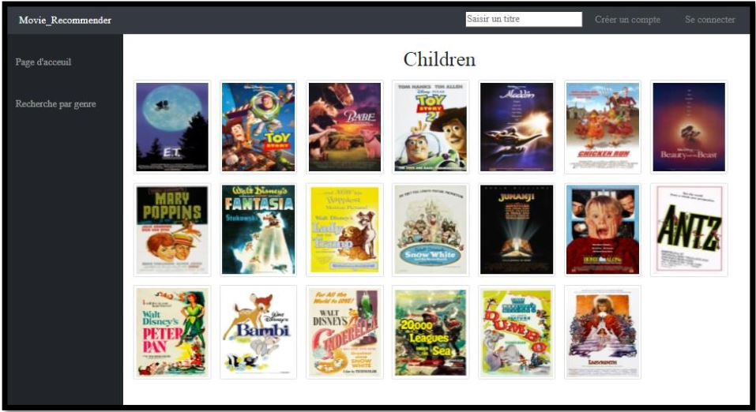

# Zakia MAHMOUDI
Data scientist | Master's degree + Engineer's degree in "Information Systems Engineering and Management" | Machine Learning | Deep Learning | Computer Vision | NLP | Statistics | Web Scrapping | Python | SQL | Excel |

# Education
* Master’s degree in "Information Systems Engineering and Management" - National Polytechnic School of Oran.(2021)
* Engineer’s degree in "Information Systems Engineering and Management" - National Polytechnic School of Oran. (2016-2021)
* Baccalaureate in Mathematics - High School of Aït Yahia Moussa. (2013-2016)

# Specializations and Courses
## Specializations :
*	IBM Data Science Professional Certificate. (IBM, Coursera)
*	Data Science Fundamentals with Python and SQL. (IBM, Coursera)
*	Excel Skills for Business. (Macquarie University, Coursera)
*	TensorFlow Developer Professional Certificate. (DeepLearning.AI, Coursera)

## Courses :
* Convolutional Neural Networks with TensorFlow in Python. (365 Data Science)
*	A/B Testing in Python. (365 Data Science)
*	Web Scraping and API Fundamentals in Python. (365 Data Science)
*	Statistics for Data Science with Python. (IBM, Coursera)
*	Computer Vision. (Kaggle)
*	Intermediate Machine Learning. (Kaggle)
*	Geospatial Analysis. (Kaggle)

# [Project 1: SpaceX Falcon-9 first stage Landing Prediction](https://github.com/Zakia-M/SpaceX-Falcon-9-first-stage-Landing-Prediction)

The aim of this project, is to predict if the Falcon 9 first stage will successfully land.

SpaceX advertises Falcon 9 rocket launches on its website with a cost of 62 million dollars; other providers cost upward of 165 million dollars each, much of the savings is because SpaceX can reuse the first stage. Therefore if we can determine if the first stage will land, we can determine the cost of a launch. This information can be used if an alternate company wants to bid against SpaceX for a rocket launch.

# [Project 2: Building a Movie Recommendation System](https://github.com/Zakia-M/Building-a-Movie-Recommendation-System)

This work aims to create a film recommendation system that integrates non-personalized recommendation techniques, based on popularity and association rules, and personalized techniques based on: collaborative filtering, user profile and synopsis of the films. In order to generate relevant recommendations for the user.

# [Project 3: Using the GPT 2 model for movie synopsis generation](https://github.com/Zakia-M/Using-the-GPT-2-model-for-movie-synopsis-generation)

The objective of this project is to exploit the potential of the OpenAI GPT-2 model, to build a system for generating film synopses based on two large datasets known worldwide : Wikipedia Movie Plots (~35,000 movies descriptions) & The Movies Dataset (Metadata on over 45,000 movies from MovieLens)

## Contact
* You can contact me through my email address : **zakiamahmoudiii@gmail.com** or my phone number : **+213673722644**
* Linkedin Account : https://www.linkedin.com/in/zakia-mahmoudi-276b8923a/
* GitHub Account : https://github.com/Zakia-M

Check my [resume](https://github.com/Zakia-M/Zakia-Portfolio/blob/main/Resume%20_%20Zakia%20Mahmoudi_f.pdf)
